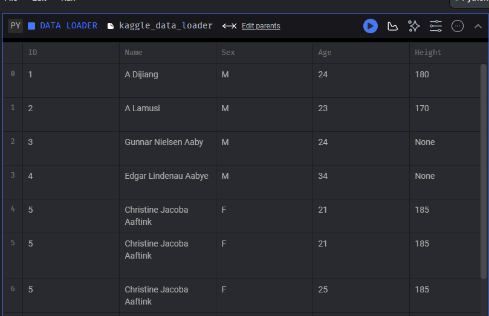
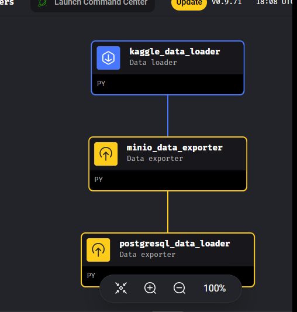
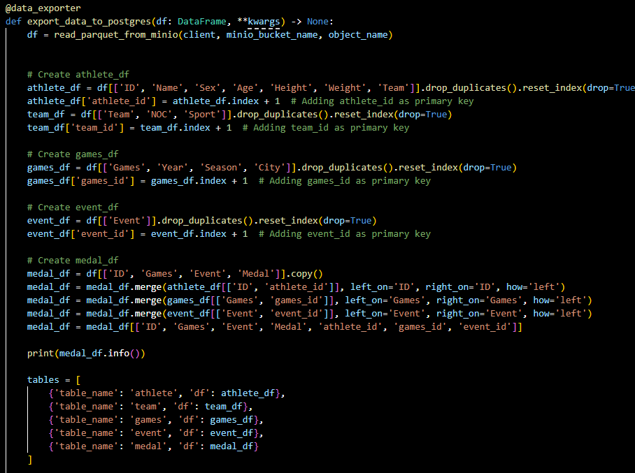
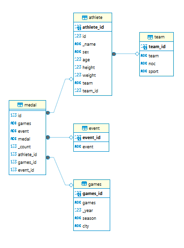
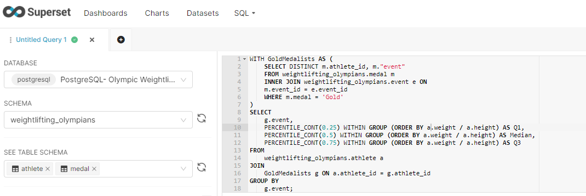
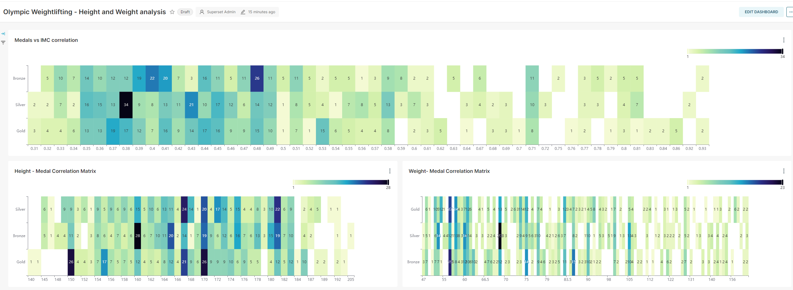

# PUC Rio - Data Science & Analytics

## Data Engineering Sprint Project - Weightlifting Olympic History

### Goal
Within the Weightlifting Olympic History topic, this project aims to explore whether there’s a correlation between a higher weight-to-height ratio (Body Mass Index, BMI) on olympic weightlifting medalists across all competition years.

### Description
This project uses the Kaggle Dataset named as **[120 years of Olympic history: athletes and results](https://www.kaggle.com/datasets/heesoo37/120-years-of-olympic-history-athletes-and-results)** as it's unique data source. The data is fetched from Kaggle programatically through Python code orchestrated on Mage.ai, stored in a object storage solution (MinIO), fetched from the object storage layer and finally transformed to be loaded into a Relational Database (PostgreSQL) in a star schema data structure. After loaded into the data warehouse layer (PostgreSQL) the exploratory analysis and data visualizations are created using Apache Superset.

##### Technologies and Versions used in this project:
- Docker: 24.0.5 - Container Engine
- Minio: RELEASE.2024-06-22T05-26-45Z - Object Storage
- Postgres: 16.3-alpine - Relational Database / Data Warehouse
- Apache Superset: e274925-py310 - Data Visualization
- Mage AI: 0.9.71 - Data Orchestration

##### Running the Project locally
1. Install Docker and Docker Desktop
2. Clone this Repository
    
    2.1. Change the KAGGLE_USERNAME and KAGGLE_KEY variables on mageai/Dockerfile

3. Run `docker-compose up`
4. Go to the Data Orchestrator tool UI on localhost:6789 and Create a new pipeline named `olympic_weight_lifting_data_analytics` with the following blocks:
    - Create a new Data Loader block named kaggle_data_loader - Paste the code from mageai/kaggle_data_loader.py
    - Create a mew Data Exporter block named minio_data_exporter - Paste the code from mageai/minio_data_exporter.py
    - Create a new Data Exporter block named postgresql_data_loader - Paste the code from mageai/postgresql_data_loader.py
    - Copy the content of mageai/io_config.yaml into the new pipeline default_repo/io_config.yaml
5. After the pipeline is created, go to: Pipelines, select `olympic_weight_lifting_data_analytics` and select `Run@once`
6. After the above steps, the data will be loaded and available at the running Postgres database. The data was inserted based on a Data Warehouse Star Schema that will be explained further in this document.

7. Now, go to the Data Visuaization tool (Apache Superset) - available at localhost:8088 using the following credentials:
    - username: admin
    - password: password
    - After loging in, go to settings > databases > + database and add the following:
        - Host: datawarehouse
        - Port: 5432
        - Username: admin
        - Password: password
    - On the tool, we are able to create SQL queries, Graphs and Dashboards which will be explained further in this document.

### Data Engineering Concepts Applied in the Project

#### Data Lake
A **Data Lake** is a centralized repository that allows storage of structured, semi-structured, and unstructured data at scale. It enables diverse analytics and data exploration. In this project, the BRONZE layer is represented by the MinIO service (Object Storage layer)

#### Data Warehouse
A **Data Warehouse** is a structured repository that consolidates data from various sources to support business analytics and reporting. It is optimized for querying and analysis. In this project, represented by PostgreSQL

#### Data Orchestrator
A **Data Orchestrator** coordinates and manages data workflows and processes within a data ecosystem. It ensures efficient execution and scheduling of data operations. In this project, represented by MageAI.
Obs: PySpark cand be executed in a distributed fashion by MageAI.

#### Data Pipeline
A **Data Pipeline** is a series of automated processes for moving and transforming data from sources to destinations. It enables reliable and scalable data movement and integration.

#### Distributed Processing
Mage.ai enables **distributed processing** by providing a robust framework for task distribution, node coordination, scalability, fault tolerance, resource management, data handling, and algorithm support in a distributed computing environment. This architecture allows organizations to leverage distributed processing capabilities efficiently for a wide range of computational tasks.

        

### Step-By-Step

#### Collect
1. Inside the Orchestrator data pipeline, the data is fethed programatically using a Python script and the following Python libraries: pandas, requests and kaggle. This script is the mageai/kaggle_data_loader.py.

    

        
    

    

2. After fetching data from Kaggle, also in mageai/kaggle_data_loader.py, the following data quality checks are run:
    - Data Types and Non-Null Count 
        - For this one, the DataFrame.info() function is used
            -  Here we can observe that some collumns have Null values which may impact the analysis further
            - The Medal column is expected to have null values
            - The columns Age, Height, and Weight - Athlete attributes, are not expected to have null values and they are null for some observations.
    - Missing Values
       - DataFrame.isnull().sum() Functions are used to confirm the previous null observations. Again, we detect that for some cases the Age, Height and Weight are null in the dataset
    - Duplicate rows check
        - DataFrame.duplicated() is used to identify the duplication fo rows
        - 1385 duplicated rows are found, from a total of 271115 

    For all the above the data quality checks, the required transformation steps to mitigate the observed problems are done in the transformation before loading, more specifically in the mageai/postgresql_data_loader.py script

3. The data is loaded to the object storage layer (MinIO) and stored as parquet. This is a common pattern for the raw layers of Data Lakes. No other transformations are happening at this stage. This is done on purpose so the objects stored in MinIO are a reflection of exactly watch was fetched from Kaggle. This code is available at mageai/minio_data_exporter.py

    

        
    

    

#### Modeling and Loading
4. The data is read from the Object Storage and transformed using the pandas Python library to match a star schema. The transformations needed, identified on the data quality checks are also executed at this stage. Finally, this scripts write the tables to the Data Warehouse layer (PostgreSQL), creating the tables and the relations between then. this code is available at mageai/postgreql_data_loader.py

    

        
    

    

    
    Complete code is available at mageai/postgreql_data_loader.py

    

        
    

    

#### Analysis
5. Once the data is available on Postgres, the Data Visualization layer (Apache Superset) can directly connect and issue queries against it. In this Project, the queries, graphs and dashboard were created through Apache Superset.

    On Apache Superset, the Database Tables are available to be queried and visualized

    

        
    

    

    Based on the above query, it was created a Dataset on Apache Superset itself - an entity that enables the creation of Graphs and Dashboards (Groups of Graphs)

    

        
    

    

#### Conclusion

After analysing 120 years of Olympic Weightlifting Athletes Data, and the correlation between the Height, Weight, and IMC (Weight / Height ratio) of all medalists historically, this projects concludes that:

- A higher IMC *does not* correlates directly to a greater incidence of medals
- The Height range between 160cm and 182cm have a considerable concentration of medals when compared to other height ranges
- Unlike the Height range mentioned previously, there is no Weight range that concentrates more olympic medals historically

